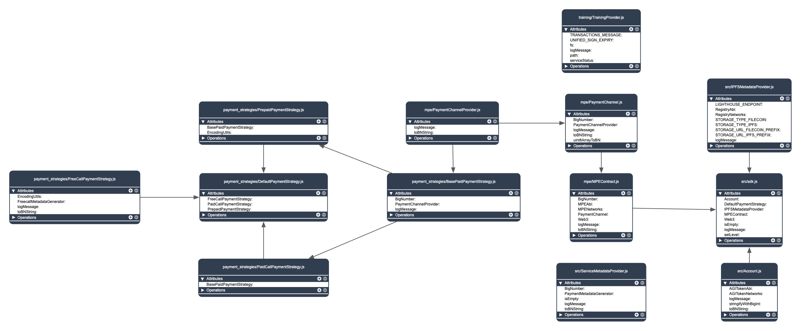

# snet-sdk-core
SingularityNET SDK core for JavaScript
  
## Getting Started
This package provides the core functionality for interacting with the AI service daemon, handling connections, and managing payment strategies. It serves as the common foundation for both [Node.js](https://github.com/singnet/snet-sdk-node) and [Web](https://github.com/singnet/snet-sdk-web) JavaScript SDKs.

## Features
- Daemon Connection Management: Establish and maintain connections with the AI service daemon
- Payment Strategy Abstraction: Support for multiple payment methods with easy extensibility
- Request/Response Handling: Standardized communication with AI services
- Cross-Platform Compatibility: Works in both Node.js and browser environments
- MetaMask Integration: Built-in support for Ethereum payments via MetaMask wallet

## Installation
```
npm install snet-sdk-core
```
## Architecture



## Usage
### Prerequisites
Before using the Core JS SDK, ensure:
- Your wallet has sufficient ETH balance to cover transaction gas costs
- Your wallet has enough AGIX or FET tokens to cover service execution costs

### Required Implementations
For a complete solution, you'll need to implement:

| Component | Description |
|-----------|-------------|
|Service Client | Network communication handlers for your target environment |
|Payment Strategies|Web/Node-specific versions of Free, Paid, and Prepaid strategies|
|Wallet Adapter| Platform-specific wallet/account management|
|Stubs| Generate and use stubs from .proto depending on the type of platform|

### Payment Strategies
#### Overview
The SDK provides three payment strategies:

<b>Paid</b>
Pay-per-call model where each service call is individually charged

<b>Prepaid</b>
Fund a prepaid balance that gets consumed with each service call. Ideal for:
- Concurrent service calls
- Batch processing
- High-frequency usage scenarios

<b>Free Call</b>
Use available free call allowances (if applicable to your account).

<b>Default (Recommended)</b>
The smart strategy that automatically:
- Uses free calls when available
- Falls back to paid strategy when free calls are exhausted

Since the Core JS SDK serves as the foundation for both Web and Node.js SDKs To implement a complete solution, you'll need to:
- Extend payment strategy classes
- Implement service clients
- Define method descriptors


### Best Practices
Error Handling: Implement consistent error handling across all strategies
a
Testing: Verify each payment strategy works in your target environment

Type Safety: Use TypeScript interfaces for method descriptors

## Development
The SNET JS SDK consists of three packages:

- `core` – The main SDK functionality.
- `nodeJS` – Node.js-specific implementations.
- `web` – Web (browser) integrations.

### Working on the Core Package
If you're making changes to the core package, you should test its compatibility with both the `web` and `nodeJS` packages. Here's how:

1. Set Up the Workspace

Place all three packages (`core`, `nodeJS`, and `web`) in the same parent folder.
Example structure:

```
/workspace/
  ├── snet-sdk-core/
  ├── snet-sdk-nodejs/
  └── snet-sdk-web/
```

2. Build the Core Package

Navigate to the core package and run:

```
cd snet-sdk-core
npm run build
```
This generates the compiled output in `snet-sdk-core/dist.`

3. Link the Local Core Package

In the `nodeJS` and `web` packages, replace the `snet-sdk-core` dependency with a local file reference.

Update their respective `package.json` files to:

```
"snet-sdk-core": "file:../snet-sdk-core/dist"
```

Then, reinstall dependencies in each package:

```
npm install
```

Now, changes in the core package will reflect in the dependent packages during development and you can check all functionality using examples of `web` and `nodeJS` SDKs.

### Handling Signature / Binary
The grpc API metadata is a map of key, value pair to store the headers.  
The value can be either String or Buffer.  
 
All binary headers should have `-bin` suffix in their names. Vice versa.
A String header's name must not end with this.  

NodeSDK and WebSDK use [grpc](https://www.npmjs.com/package/grpc) and [@improbable-eng/grpc-web
](https://www.npmjs.com/package/@improbable-eng/grpc-web) respectively to make grpc API calls.

<br/> 
[LICENSE](https://github.com/singnet/snet-sdk-js/blob/master/LICENSE) file for details.
